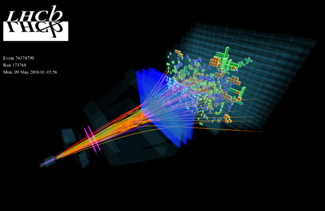

# LHCb_muon_track

# LHCb

* __All data__ for checking perfomance of distinguishing muons from background is  [here](https://drive.google.com/open?id=1P3LOsP02JzD6rVx-1KZLhTG3eT5c44kW).

* Installing dependencies: 
`pip install -r <path_to_rep_requirements.txt>`.This is file with all necessary libraries.

* 
Data after undersampling is called `data_undersampled.hdf` is a processed data from LHCb.

* 
Notebook with all learned models after undersampling is called `Final.ipynb` .

* Py scripts are for launching different hypothesis, such as polynomial features and probability density.

GridSearchXGB.py  -  processing gridsearch for XGBoost
Polynomial2_new.py - processing XGBoost with polynomial features
XGB_data_true4.py  - processing baseline XGBoost
XGB_top20.py      - processing XGBoost on top 20 features selected by Random Forest
XGB_top20+d.py    - processing XGBoost on top 20 features with $d^2$-feature
XGB_with_dsquare.py   - processing XGBoost with $d^2$-feature
ROC_AUC_plotting.ipynb  - plotting roc_auc graphs
top20model.joblib    - extracting top 20 features using Random Forest
Data_processing&velocity|acceleration.ipynb   - processing data, calculated velocity and acceleration features and fitting XGBoost, LightGBM and CatBoost on undersampled data with velocity and acceleration data. 
